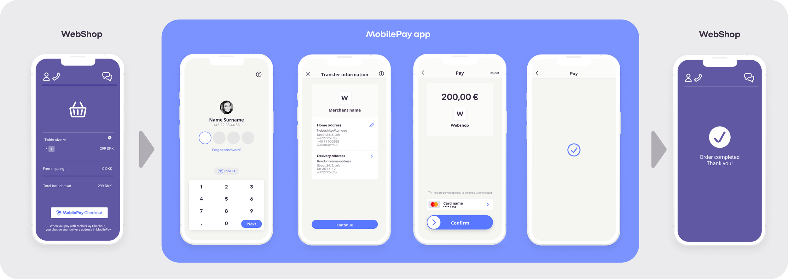
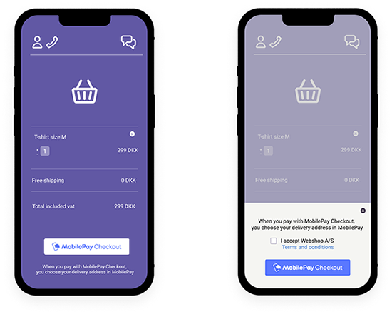
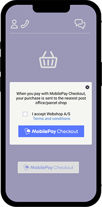
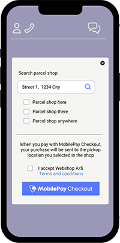

# MobilePay Checkout best practice

## Table of Contents
  - [What is MobilePay Checkout?](#what-is-mobilepay-checkout)
  - [Best practice](#best-practice)
  - [Decide how delivery is to be handled](#decide-how-delivery-is-to-be-handled)

MobilePay Checkout lets webshops offer their customers a faster and easier purchase flow by linking payment and delivery details.

The customer can easily approve the order in his/her MobilePay –and the webshop receives the information to be used to process the order.

## What is MobilePay Checkout?

 - An add-on for MobilePay Online –which does not cost extra 
 - Is available via the PSPs which support the solution. See the PSPs [here](https://mobilepaygroup.com/partner/payment-service-providers) 
 - Requires a special technical integration to the webshop's PSP –contact your PSP for further information
 - Available for selected shop systems –contact your PSP for further information

If you build your own webshop (or if someone else does it for you) –you will need to integrate MobilePay Checkout into your webshop yourself. You may do so in a way that is optimal for your webshop–including the placement of the MobilePay Checkout button as well as handling of delivery.

The following documentation show examples of best practice and examples –for your inspiration –of how a given webshop can build MobilePay Checkout into the webshop.

## Best practice

**Placing the MobilePay Checkout button in the webshop**

Place the MobilePay Checkout button in the webshop where it makes sense

It is entirely up to you where you place the button in your user flow – but please make sure that it is easy for your customers to find the button and pay. Consider where you want to place the button, e.g. at the end of the user flow, as an alternative to the normal checkout flow or close to the product to create a ‘buy now’ experience.

Only use approved MobilePay buttons: [Find buttons](https://cdn.mobilepay.dk/res-website/img/assets.html)

**You may use overlay or pop-up for additional end-user choices, e.g. for acceptance of terms and conditions**

Follow best practice and provide the user with an overview of the order before he/she accepts it.

**Mandatory**! Always insert the mandatory text where you place the MobilePay Checkout button. The mandatory text must always appear before the user accepts the order.
Note: the final text depends on the choice of delivery method. Find mandatory texts on the next slides.

Use e.g. overlay or pop-up windows in the webshop to display additional options for the end user. This may be approval of the shop’s terms and conditions or choice of delivery method.
The MobilePay Checkout button directs the end user to the MobilePay app, where delivery information and payment are approved.

Please note: Checkout without use of overlay is also possible but you must ensure to add the mandatory text close to the Checkout button.

## Decide how delivery is to be handled
This is to be defined and constructed in the webshop

**The simple solution** 
*Short user flow / fewer choices*
(See [Delivery option 1](#delivery-option-1---simple-solution) and [Delivery option 2](#delivery-option-2---simple-solution)) 
 - The webshop constructs the solution so that the delivery method is selected on behalf of the customer 
 - This means a minimum of user interaction and the fewest possible checkout steps
 - The checkout flow is short and the user can complete his/her purchase quickly and
   easily

**The flexible solution**
*Longer user flow / more end-user choices*
(See [Delivery option 3](#delivery-option-3---flexible-solution))
 - The webshop constructs the solution so that the customer is given a choice between several delivery methods in the webshop
 - The solution provides several options for the customer, e.g. choice of post office/parcel shop or different suppliers with different prices
 - The checkout flow will be a little longer, with a few more user choices, which may be relevant for some webshops and their customers

## Delivery option 1 - Simple solution

MobilePay Checkout is integrated in the webshop with delivery to an address (e.g. home address or workplace)

 - In MobilePay the customer must select a delivery address (Specify the correct configuration for MobilePay Checkout. See more in the PSP documentation).
 - After the customer has approved his or her delivery details in MobilePay the order confirmation can be generated by the webshop. 
 - Insert the mandatory text close to the MobilePay Checkout button in the user flow in the webshop.

**Mandatory text**
> ENG: When you pay with MobilePay Checkout you choose your delivery address in MobilePay
> 
> DK: Når du betaler med MobilePay Checkout, vælger du din leveringsadresse i MobilePay

     

## Delivery option 2 - Simple solution

MobilePay Checkout is integrated in the webshop with automatic delivery to the nearest parcel shop

 - The pickup location closest to the customer’s address in MobilePay is automatically selected by the webshop. 
 - NB! Depends on the carrier’s options and setup in the webshop (Specify the correct configuration for MobilePay Checkout. See more in the PSP documentation). 
 - Insert the mandatory text close to the MobilePay Checkout button in the user flow.
 
*Mandatory text*
> ENG: When you pay with MobilePay Checkout your purchase is sent to the nearest post office/parcel shop
> 
> DK: Når du betaler med MobilePay Checkout, sendes dit køb til nærmeste posthus/pakkeshop

     

## Delivery option 3 - Flexible solution

MobilePay Checkout is integrated in the webshop with delivery to a parcel shop selected by the customer

 - Allow the customer to choose a pickup location (including pick-up in a store) before MobilePay Checkout is activated – e.g. in an additional overlay or pop-up window in the webshop (depends on the webshop's setup and the options provided by the carrier chosen by the webshop). 
 - In MobilePay, the customer is therefore not to choose a delivery address (Specify the correct configuration for MobilePay Checkout. See more in the PSP documentation). 
 - Insert the mandatory text close to the MobilePay Checkout button in the user flow.

**Mandatory text**
> ENG: When you pay with MobilePay Checkout, your purchase will be sent to the pickup location you selected in the shop
> 
> DK: Når du betaler med MobilePay Checkout, sendes dit køb til den afhentningssted du har valgt i butikken
