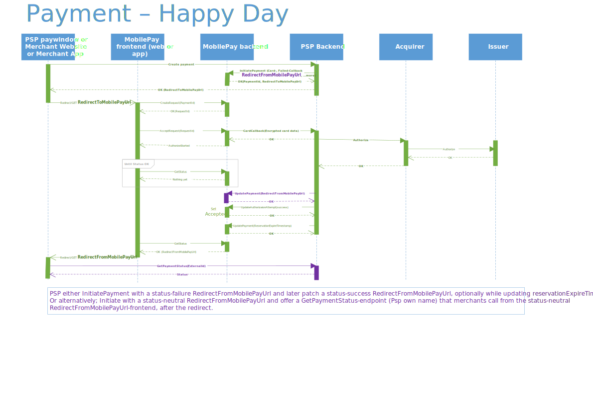

# MobilePay Online


## Table of Contents
  - [Table of Contents](#table-of-contents)
  - [Product description](#product-description)
  - [Development Guide](#development-guide)
  - [API guidelines](#api-guidelines)
  - [Sandbox environment](#sandbox-environment)
  - [Merchants](#merchants)
  - [Payments](#payments)
  - [Request Fishing Scenario](#request-fishing-scenario)
  - [Restrictions](#restrictions)
  - [Strong Customer Authentication (SCA)](#strong-customer-authentication-sca)
  - [Callbacks](#callbacks)
  - [Prefilled phone number](#prefilled-phone-number)
  - [Automated integration tests in Sandbox](#automated-integration-tests-in-sandbox)

**Appendix**<br />
  - [Merchant documentation](#merchant-documentation)
  - [Error codes](#error-codes)
  - [Retry policy](#retry-policy)
  - [Allowed currencies](#allowed-currencies)
  - [Allowed card types](#allowed-card-types)
  - [Diagrams](#diagrams)
  - [Embedded Flow](#embedded-flow)

## Product description

MobilePay Online is essentially a way for the user to accept eCommerce/online payments in the MobilePay app. When the user accepts the payment, their card data is encrypted and transferred to the PSP who can then do the authorization towards the aquirer chosen by the web shop.
[](./assets/MPO%20stylized%20flow.svg)
You can find an example of a MobilePay Online flow [here](https://www.mobilepay.dk/mobilepaymedia/mobilepay-dk/films/product/mobilepay-online-2018.mp4).

MobilePay is a digital wallet for iOS and Android that can be used for person to person transfers, in-store purchases, subscriptions, invoices, eCommerce transactions etc. The documentation on this page covers the technical setup of the eCommerce functionality and is directed at Payment Service Providers that wish to offer MobilePay as a payment method to their customers (i.e. web shops). 

## Development Guide

In order to implement MobilePay Online you must first obtain an agreement by contacting partnership_online@mobilepay.dk. If you have already signed an agreement with MobilePay for the use of MobilePay Online, you can skip this step

When your agreement is signed, please visit our Developer Portal to start the technical onboarding: https://developer.mobilepay.dk/products/online/getting-started <br>
You will also find the API on the Developer Portal: https://developer.mobilepay.dk/product (click 'Online').
The diagrams in the appendix [Diagrams](#diagrams) should also be helpful to understand the different flows.

On the developer portal you will  find information about [test](https://developer.mobilepay.dk/products/online/test) and [how to move to production](https://developer.mobilepay.dk/products/online/verification). 

## API guidelines

As a rule of thumb, the APIs are RESTful. You can expect POSTs to return the id of the resource created.

## Sandbox environment

The MobilePay Sandbox is a self-contained, testing environment that mimics the live MobilePay production environment. It provides you the space to play around and test your implementation and the requests you make to the MobilePay APIs without affecting MobilePay for the users.
Find information about test app and sandbox test here: https://developer.mobilepay.dk/products/online/test

## Merchants

As a PSP, you need to create the merchants in MobilePay in order to create payments on their behalf.

This can be done by invoking the "create merchant" endpoint (POST /merchants/).

When a Merchant is no longer using the solution it must be offboarded using the "delete merchant" endpoint.

## Payments

1. In order to create a payment you need to invoke the "create payment" endpoint (POST to /payments/).
To use this you need to provide information about the merchant, the payment, the public key used for encrypting the data, callback-, and redirection urls.
This will return an url the end-user should be redirected to.

2. When the user has accepted the payment in the MobilePay app, you'll receive a callback on the url defined in 1. containing the encrypted card data and you can create the authorization.

3. When you have successfully authorized the payment (or it has failed), you'll patch the authorisationAttempt and we'll show a receipt (or error message) to the user. Do not expect the user to return client side / in the UI.

4. When the merchant makes captures, refunds, or cancels the payment the status of the payment must be updated to reflect this to give the best possible user experience. See the API.

## Request Fishing Scenario

This scenario is a thought out "attack" where a fraudster tricks someone else to pay for the goods, by sending the request to multiple users from our "dual device" website, until someone accepts the payment. 

Initialize payment (POST /payment/) is idempotent. However, if it is called with the same set of MerchantId and OrderId, but anything else has changed - request fishing will be initiated.
Depending on the scenario a DomainError will be returned stating the problem. If the user initiates  more than 3 payments, with the same MerchantId and OrderId, a permanent DomainError will be returned.

## Restrictions

A payment will time out within 35 minutes, meaning that the whole process of user accepting, callbacks made and authorization must be completed within 35 minutes.
Furthermore after you get the callback containing the card data, you must update the status of the authorization to either "authorize-succesfull" or "authorize-failed" within 32 seconds to ensure a smooth experience for the user waiting for the confirmation.

## Strong Customer Authentication (SCA)

We aim to ensure Delegated Authentication (DA). This means that responsibility for authenticating the customer/payer no longer lies with the Issuer, but is delegated to MobilePay.  When/if we fail, and the Issuer is responding to an authorisation attempt with a Soft Decline/"step-up", a 3-D Secure fallback solution must be in place.

### Delegated Authentication for Dankort
As long as you use the tags and values described here, all is well. Nets will recognize MobilePay and trust our authentication process.

Use POS code: ‘K005K0K00130’.
#### Using Nets SDI specification
In Field S120 tag 36: the value of 8844101001</br>
In Field S120 tag 70 pos 14 (exemption Tag): the value of 3 for Delegated Authentication
#### Using Nets TRG PSIP/ ISO 8583 / Merchant Guide SSL
In Field 47 tag 7R: the value of 8844101001</br>
In Field 47 tag V!: the value of 23


### Delegated Authentication for all Visa cards
When you initiate a payment, make sure to use v3 of the API. Here you give a tokenCallbackUrl for all accepted Visa types. However, please also provide a carddataCallbackUrl as failover, because not all Visa cards can be tokenized. For Dynamic Linking, please give us MerchantUrl and MerchantName.</br>
[](./assets/token.svg)

When you recieve the tokenCallback, you´ll find a cardIssuedInCountryCode (possible values DK, FI) you can use for your Acquirer routing logic. And a Visa Token Service (VTS) service response like this: <br />
```
{
	"paymentId": "string",
	"authorizationAttemptId": "string",
	"cardType": "string",	
	"cardIssuedInCountryCode": "string",
	"maskedCardNumber":"string",
	"tokenMethod": "string",
	"tokenData": {
		"vPaymentDataID": "string",
		"cryptogramInfo": {
			"cryptogram": "string",
			"eci": "string"
		},
		"paymentInstrument": {
			"last4": "string",
			"paymentType": {
				"cardBrand": "string"
			},
			"paymentAccountReference": "string"
		},
		"tokenInfo": {
			"token": "string",
			"last4": "string",
			"expirationDate": {
				"month": "string",
				"year": "string"
			}
		},
	},
	"isDelegatedAuthentication": bool
}
```
</br>
Example: </br>

```
{
   "paymentId":"8dab9219-ab03-4524-bae7-f0ad55119da5",
   "authorizationAttemptId":"32eedb2b-a536-4eb6-b618-c2d6c1bf7aab",
   "cardType":"VISA-CREDIT",
   "cardIssuedInCountryCode":"DK",
   "maskedCardNumber":"479694XXXXXX1234",
   "tokenMethod":"VTS",
   "tokenData":{
      "vPaymentDataID":"da17bd1568bdc8b418d71cf80c44ea02",
      "cryptogramInfo":{
         "cryptogram":"/wAAAAwAUkMTObMAAAAAgS0AAAA=",
         "eci":"07"
      },
      "paymentInstrument":{
         "last4":"1234",
         "paymentType":{
            "cardBrand":"VISA"
         },
         "paymentAccountReference":"V0010013020217426481676671969"
      },
      "tokenInfo":{
         "token":"4895737462013403",
         "last4":"3403",
         "expirationDate":{
            "month":"02",
            "year":"2023"
         }
      }
   },
   "isDelegatedAuthentication": false
}
```
Please pass the data to the Acquirer, as you would do if the VTS response was from you own VTS integration. In case you have questions to the Acquirer API, ask the Acquirer.

When you get the tokencallback, if you internally (without calling anyone) know, that token will not work for this payment, please reply HTTP code **501**, we will then immediately fail over to PAN callback. 

Exactly as for PAN callbacks, make sure you response to the callback immediately. DO NOT leave the transaction "hanging" while you call out to the Acquirer. 

### Delegated Authentication for all Mastercards
The flow is similar to Visa VTS because both are based on the EMVCo standard. However Mastercard S4C carry sligtly different data in our callback:
```
{
   "paymentId":"1ba21790-5e10-4db1-8e90-330fb41916e7",
   "authorizationAttemptId":"3205ec7c-2d50-49d2-95dc-326e34edce47",
   "cardType":"MC-CREDIT",
   "cardIssuedInCountryCode":"DK",
   "maskedCardNumber":"520473XXXXXX4792",
   "tokenMethod":"MC S4C",
   "tokenData":{
      "token":{
         "paymentToken":"5204731613942625",
         "tokenExpirationMonth":"05",
         "tokenExpirationYear":"2024",
         "paymentAccountReference":"5001BO8B9NXVVIXCT0HAJU98I512Z"
      },
      "dynamicData":{
         "dynamicDataType":"CARD_APPLICATION_CRYPTOGRAM_SHORT_FORM",
         "dynamicDataValue":"MD1eEaqbngDNAy0iuRqOAAADFEA="
      },
      "eci":"06"
   }
}
```

### 3DSecure Fallback
If Delegated Authentication fails, the 3DSecure fallback solution applies. 

[](./assets/3dsfallback.svg)
Please notice the purple ”Wallet locked” and ”Wallet unlocked” in communication between MobilePay App and MobilePay Backend. This will ensure, that the user/payer can pick a different card from his wallet, when his first attempt is ”soft rejected”. It will also ensure that he cannot pick another card to start a parallel authorization-attempt while the second attempt on the first card is being processed. For this to work, the PSP must call MP backend with reasonCode=1009 as soon as it has crypto (Ares/Pres) from SCA, before retrying the authorization-attempt towards Acquirer and Issuer.

When the user has completed the challenge, please immediately redirect to https://products.mobilepay.dk/remote-website/apppages/done3ds.html
For Sandbox use: https://sandprod-products.mobilepay.dk/remote-website/apppages/done3ds.html


## Callbacks

As a rule of thump, MobilePay Online is idempotent in all operations. Likewise, we expect PSPs to be able to handle the same callback more than once in the event of transient errors on network, ours or your side.
This means that if we make a callback to you on a given payment id or a given authorization attempt, you may receive the same data more than once and should ensure that your systems are able to handle that.
We will retry our callbacks for more than 5 seconds in the event of network errors or non 200-range http status codes in your responses.

### Card data callback

A callback will be made on the CardDataCallbackUrl when the user swipes to accept the payment. The callback will have a JSON body like this:
```
{
  'EncryptedCardData': 'fsfnsdjkfbgdft34895u7345',
  'PaymentId': 'a84781b3-af34-42ae-b296-260cfb6859fe',
  'AuthorizationAttemptId': 'ba12c5d5-8fd1-49cc-bc3f-2cb2ecb888c7',
  'PublicKeyId': 263012,
  'CardType' : 'DANKORT'
}
```
The EncryptedCardData is encrypted according to this OAEP algorithm&padding scheme: RSA/NONE/OAEPWithSHA256AndMGF1Padding . 
Once decrypted, you´ll see:
{"timestampticks":123456789123456789,"encryptedCardData": { "cardNumber": 1234567812345678, "expiryMonth": 12, "expiryYear": 28 }

Make sure you response to the callback immediately, once you´ve decrypted the content. DO NOT leave the transaction "hanging" while you call out to the Acquirer. 

### Failed callback

In case the payment times out, a callback is made to the FailedPaymentCallbackUrl url supplied in the initiate payment call.

```
{
    'code': '100',
    'reason': 'Payment expired',
    'paymentId': '8d72ece4-1b0b-464b-98d9-6bbb02199dc8'
}
```

### Checkout callback

A callback will be made on the AddressCallbackUrl when the user swipes to accept the payment and isCheckout is set to true. The callback will have a JSON body like this:

```
{
  'PaymentId': '9369ea35-4b5b-428a-bdf8-c29c29a4b264',
  'AuthorizationAttemptId': 'a8c99cbf-3468-4eb9-9c0e-ddd110e8ed33',
  'Addresses': [{
    'FirstName': 'John',
    'Surname': 'Doe',
    'Attention': '',
    'CompanyName': '',
    'AddressLine1': 'Flower Street 23',
    'AddressLine2': '',
    'PostalCode': '3434',
    'City': 'Great city',
    'CountryCode': 'DK',
    'IsCustomerOfficialAddress': true,
    'IsBillingAddress': true,
    'IsDeliveryAddress': true,
    'AddressValidationMethod': 'DaWa',
    'AddressValidationStatus': 'NotValidated'
  }],
  'EmailAddress': 'johndoe@gmail.com',
  'EmailAddressValidationMethod': 'EmailEnteredTwice',
  'EmailAddressValidationStatus': 'Validated',
  'PhoneNumber': '+4512345678',
  'PhoneNumberValidationMethod': 'SMSChallenge',
  'PhoneNumberValidationStatus': 'Validated'
}
```
### Endpoint security
To ensure no unauthorized calls to your callback endpoints, we strongly suggest you apply either (or both) of these limitations:
1. Firewall rules. These are the IP-ranges that MobilePay backend will be calling from: 212.93.32.0/19 and 185.218.228.0/22
2. SSL "Common name" inspection. The "Common name" in our SSL client certificate should never change. Even when the certificate itself changes, or is issued to a different root.

## Invalidation of a payment
In some cases the user goes back to the merchant webshop and adds something to the shopping basket after the payment has been initiated. The user could end up with several requests with different amounts and there would be a possibility, that the user accepts the wrong one in MobilePay. In this case payment invalidation endpoint can be useful. When the invalidation is completed, it means that the user cannot create a request for the payment or accept the payment. Active requests will also expired immediately.

### Invalidation before callback
If the invalidation request is received by MobilePay before the callback to the PSP is made, no callback will be performed and the invalidation will complete.


### Invalidation after callback
If the invalidation request is received by MobilePay after the callback to the PSP is performed, the PSP must also PATCH the authorizationAttempt with succeeded=false and the ReasonCode 1010 - RejectedForInvalidatePayment.

In this case the invalidation request will be processed in the MobilePay backend according to these rules:
1. If a successful authorization already exists on the payment, the invalidation endpoint will return the error code 2100.
2. If a callback has been sent but the authorization attempt has not yet been patched or 3DS is ongoing, the invalidation endpoint will return the error code 2101. The authorization attempt must be patched with e.g. reasoncode 1010 before invalidation.
3. A failed authorization will result in a successfull invalidation.


## Prefilled phone number
You can provide a phone number to be prefilled in the phone number field on the MobilePay webpage. 
You do this by adding an URI encoded "alias" parameter with the phone number to the search parameters of the "redirectToMPUrl". The phone number must be fully specified including country code. For "+45 12 34 56 78" you would add the following to the url: &alias=%2B4512345678

## Automated integration tests in Sandbox

The Api supports automated integration tests running in Sandbox and can be found at [sandbox-developer](https://sandbox-developer.mobilepay.dk/product) under 'Online User Simulation' and then 'Cardpassthrough RegressionTester For Product'. The api support simulation of the required user actions from payment request to capture. For more information on the general payment flow, please see [the diagram section](#Diagrams).

**Please refrain from any overly aggressive testing strategies, we expect any continously running tests to call at most once per second.**


# Appendix

## Merchant documentation
The documentation towards you customers, the merchants, must - at least - tell about
* *Name* displayed in the app to the end user
* *LogoUrl* linking to an image file displaying the merchant logo in the app to the end user

    * 250x250 pixels
    * Hosted using a secure HTTPS connection
    * PNG or JPG
    * Set content-type in the HTTP header using *MIME* types e.g. *image/png* or *image/jpeg* 
* How the solution is used from a native app (API enabled)
* Common pitfalls of 'context switch' on client side<br />

   *A. Scenario - ‘browser A’ -> MP App -> ‘browser B’*<br/> 
   The Merchant return page should not rely on any sort of session object (e.g. a cookie), to recognise the returning customer. It should solely rely on data given in the redirect (redirectFromMobilePayUrl).<br />
   
   *B. Scenario - ‘browser' -> MP App’* <br/>
   The Merchant should not rely on the customer returning client side. Rather they should process the purchase when the PSP´s server-to-server callback is received, or after getting confirmation on a status endpoint.

## Error codes

The following will describe the error codes thrown and in which cases they can occur.

The error format will be the following:

```json
{
    "code": "2020",
    "message": "Some description",
    "correlationId": "8d72ece4-1b0b-464b-98d9-6bbb02199dc8"
}
```

| Code | Endpoint(s) | Description
|:---|:---|:---|
| 2000 | POST /payments | Merchant doesn't exist
| 2010 | POST /payments | The merchant isn't created by you
| 2020 | POST /payments | The merchant is deleted
| 2030 | POST /payments | Allowed card types are not set
| 2040 | POST /payments | One or more of the allowed card types are invalid
| 2050 | POST /payments | Currency code is invalid
| 2100 | PUT payments/{paymentId:guid}/invalidate | Can't invalidate payment with completed authorization attempt 
| 2101 | PUT payments/{paymentId:guid}/invalidate | Can't invalidate payment - the authorization attempt has not yet been patched with success or failure. Try again later.

## Retry policy
Even though we have above 99% uptime and handle millions of transactions each week, external factors, such as network related issues, can contribute to momentary disturbances in our response times.
To reduce the risk of such issues having negative impact on the customer experience, you should implement a retry mechanism.

Our suggestions:
* If you do not get a response within 2 seconds, try again. 
* If you get an unexpected error (HTTP > 299) wait 1 second, then try again. 
* Suggested retry count is 2 (three attempts in total). You should under no circumstance retry more than 6 times. As this could worsen any ongoing situation in our setup.

You’re welcome to make use of more advanced retry strategies (exponential back-off, circuit breakers etc.), as long as you take the suggestions above into consideration. 


## Allowed currencies

Currencies must be specified according to the ISO-4217 standard. Either using the alpha or the numeric version.
Allowed currencies are:

| Name | Alphabetic code | Numeric code
|:---|:---|:---|
| Danish kroner | DKK | 208
| Euro | EUR | 978
| Norwegian kroner | NOK | 578
| Swedish kroner | SEK | 752

## Allowed card types

The following card types are allowed:

| Card name | Code
|:---|:---|
| Visa electron | ELEC-DEBIT |
| Mastercard credit | MC-CREDIT |
| Mastercard debit | MC-DEBIT |
| Maestro | MTRO-DEBIT |
| Visa credit | VISA-CREDIT |
| Visa debit | VISA-DEBIT |
| Dankort | DANKORT |

## Diagrams

### Merchants


### Payments




### Checkout


### When acquirer or issurer rejects a payment


### When the user rejects a payment


### After authorization


## Embedded Flow

Webshops or Payment Service Providers (PSPs) may embed the web part of the flow into their own website by showing the MobilePay flow in an iframe and listen for response codes emitted from the iframe to the parent window.

Embedding is especially relevant for users on bigger screens, e.g. desktop computers, where the user will request the payment to a phone number and complete the flow in MobilePay on a phone.

On mobile devices it is expected that the MobilePay flow visually covers the whole screen (simple header and footer is acceptable).

The redirect url provided when creating the payment will be navigated inside the iframe. Be aware that you might want to show the user different content if he is inside an iframe or not. If you support both iframe and full window, we recommend that you have a neutral return page without visual content. Build your logic on the parent page to listen for the response codes and based on that navigate the user to the right page.

### IFRAME
Add an "iframe" to the html source and set the iframe "src" property to the URL returned from the payment link creation endpoint.

The width should be 375px.

Example
```
 <iframe 
        scrolling="no"
        src="URL_FROM_PAYMENTID_CREATION"
        style="width: 375px; height: 480px; border: 0;" >
</iframe>
```

### Event Listener
The parent page can listen for posted messages by adding JavaScript code like this example

```
<script type="text/javascript">
 window.addEventListener( 
   "message",
   function(event) {
      if (event.data.indexOf("mobilepay")>=0){
         //Do your logic
         //Continue purchase processing
         alert(event.data);
      }
    },
   false);
</script>
```

### Response Codes
When the flow in MobilePay is complete the iframe will be redirected to the return url specified, when the payment was created and just prior to that it will also post a message via ```javascript:postMessage()```, which the parent page can listen for via JavaScript.
The message has the following syntax, when the user ends the flow
```
mobilepay:rc=RESPONSE_CODE&message=DESCRIPTIVE_MESSAGE 
```

The response codes are
| Response Code | Description
|:---|:---|
| 0 | Completed |
| 1 | Rejected |
| 3 |	Expired |
| 4	| Cancelled |
