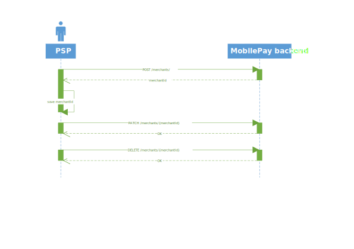

# MobilePay Online

## Table of Contents
**[Product description](#product-description)**<br />
**[Development Guide](#development-guide)**<br />
**[API guidelines](#api-guidelines)**<br />
**[Sandbox environment](#sandbox-environment)**<br />
**[Merchants](#merchants)**<br />
**[Payments](#payments)**<br />
**[Request Fishing Scenario](#request-fishing-scenario)**<br />
**[Restrictions](#restrictions)**<br />
**[Callbacks](#callbacks)**<br />

**Appendix**<br />
**[Error Codes](#error-codes)**<br />
**[Allowed currencies](#allowed-currencies)**<br />
**[Allowed card types](#allowed-card-types)**<br />
**[Diagrams](#diagrams)**<br />
**[Embedded flow](#embedded-flow)**

## Product description

MobilePay Online is essentially a way for the user to accept online payments in the Mobilepay app. When the user accepts the payment, their card data is encrypted and transferred to the PSP who can then do the authorization towards the merchant's chosen acquirer.
[](./assets/MPO%20stylized%20flow.svg)
You can find an example of a MobilePay Online flow [here](https://www.mobilepay.dk/mobilepaymedia/mobilepay-dk/films/product/mobilepay-online-2018.mp4). 

## Development Guide

In order to implement MobilePay Online you must first obtain an agreement by contacting partnership_online@mobilepay.dk. If you have already signed an agreement with MobilePay for the use of MobilePay Online, you can skip this step

When your agreement is signed, please visit our Developer Portal to start the technical onboarding: https://developer.mobilepay.dk/products/online/getting-started <br>
You will also find the API on the Developer Portal: https://developer.mobilepay.dk/product (click 'Online').
The diagrams in the appendix [Diagrams](#diagrams) should also be helpful to understand the different flows.

On the developer portal you will  find information about [test](https://developer.mobilepay.dk/products/online/test) and [how to move to production](https://developer.mobilepay.dk/products/online/verification). 

## API guidelines

As a rule of thumb, the APIs are RESTful. You can expect POSTs to return the id of the resource created.

## Sandbox environment

The MobilePay Sandbox is a self-contained, testing environment that mimics the live MobilePay production environment. It provides you the space to play around and test your implementation and the requests you make to the MobilePay APIs without affecting MobilePay for the users.
Find information about test app and sandbox test here: https://developer.mobilepay.dk/products/online/test

## Merchants

As a PSP, you need to create the merchants in MobilePay in order to create payments on their behalf.

This can be done by invoking the "create merchant" endpoint (POST /merchants/).

When a Merchant is no longer using the solution it must be offboarded using the "delete merchant" endpoint.

## Payments

1. In order to create a payment you need to invoke the "create payment" endpoint (POST to /payments/).
To use this you need to provide information about the merchant, the payment, the public key used for encrypting the data, callback-, and redirection urls.
This will return an url the end-user should be redirected to.

2. When the user has accepted the payment in the MobilePay app, you'll receive a callback on the url defined in 1. containing the encrypted card data and you can create the authorization.

3. When you have successfully authorized the payment (or it has failed), you'll patch the authorisationAttempt endpoint and we'll show a receipt (or error message) to the user.

4. When the merchant makes captures, refunds, or cancels the payment the status of the payment must be updated to reflect this to give the best possible user experience. See the API.

## Request Fishing Scenario

This scenario is a thought out "attack" where a fraudster tricks someone else to pay for the goods, by sending the request to multiple users from our "dual device" website, until someone accepts the payment. 

Initialize payment (POST /payment/) is idempotent. However, if it is called with the same set of MerchantId and OrderId, but anything else has changed - request fishing will be initiated.
Depending on the scenario a DomainError will be returned stating the problem. If the user initiates  more than 3 payments, with the same MerchantId and OrderId, a permanent DomainError will be returned.

## Restrictions

A payment will time out within 35 minutes, meaning that the whole process of user accepting, callbacks made and authorization must be completed within 35 minutes.
Furthermore after you get the callback containing the card data, you must update the status of the authorization to either "authorize-succesfull" or "authorize-failed" within 32 seconds to ensure a smooth experience for the user waiting for the confirmation.

## Callbacks

As a rule of thump, MobilePay Online is idempotent in all operations. Likewise, we expect PSPs to be able to handle the same callback more than once in the event of transient errors on network, ours or your side.
This means that if we make a callback to you on a given payment id or a given authorization attempt, you may receive the same data more than once and should ensure that your systems are able to handle that.
We will retry our callbacks for more than 5 seconds in the event of network errors or non 200-range http status codes in your responses.

### Card data callback

A callback will be made on the CardDataCallbackUrl when the user swipes to accept the payment. The callback will have a JSON body like this:
```
{
  'EncryptedCardData': 'fsfnsdjkfbgdft34895u7345',
  'PaymentId': 'a84781b3-af34-42ae-b296-260cfb6859fe',
  'AuthorizationAttemptId': 'ba12c5d5-8fd1-49cc-bc3f-2cb2ecb888c7',
  'PublicKeyId': 263012
}
```
The EncryptedCardData is encrypted according to this OAEP algorithm&padding scheme: RSA/NONE/OAEPWithSHA256AndMGF1Padding . 
Once decrypted, you´ll see:
{
  "encryptedCardData": {
    "cardNumber": "1234567812345678",
    "expiryMonth": "12",
    "expiryYear": "28"
  }
}

### Failed callback

In case the payment times out, a callback is made to the FailedPaymentCallbackUrl url supplied in the initiate payment call.

```
{
    'code': '100',
    'reason': 'Payment expired',
    'paymentId': '8d72ece4-1b0b-464b-98d9-6bbb02199dc8'
}
```

### Checkout callback

A callback will be made on the AddressCallbackUrl when the user swipes to accept the payment and isCheckout is set to true. The callback will have a JSON body like this:

```
{
  'PaymentId': '9369ea35-4b5b-428a-bdf8-c29c29a4b264',
  'AuthorizationAttemptId': 'a8c99cbf-3468-4eb9-9c0e-ddd110e8ed33',
  'Addresses': [{
    'FirstName': 'John',
    'Surname': 'Doe',
    'Attention': '',
    'CompanyName': '',
    'AddressLine1': 'Flower Street 23',
    'AddressLine2': '',
    'PostalCode': '3434',
    'City': 'Great city',
    'CountryCode': 'DK',
    'IsCustomerOfficialAddress': true,
    'IsBillingAddress': true,
    'IsDeliveryAddress': true,
    'AddressValidationMethod': 'DaWa',
    'AddressValidationStatus': 'NotValidated'
  }],
  'EmailAddress': 'johndoe@gmail.com',
  'EmailAddressValidationMethod': 'EmailEnteredTwice',
  'EmailAddressValidationStatus': 'Validated',
  'PhoneNumber': '+4512345678',
  'PhoneNumberValidationMethod': 'SMSChallenge',
  'PhoneNumberValidationStatus': 'Validated'
}
```

## Prefilled phone number
You can provide a phone number to be prefilled in the phone number field on the MobilePay webpage. 
You do this by adding an URI encoded "alias" parameter with the phone number to the search parameters of the "redirectToMPUrl". The phone number must be fully specified including country code. For "+45 12 34 56 78" you would add the following to the url: &alias=%2B4512345678
# Appendix

## Error codes

The following will describe the error codes thrown and in which cases they can occur.

The error format will be the following:

```json
{
    "code": "2020",
    "message": "Some description",
    "correlationId": "8d72ece4-1b0b-464b-98d9-6bbb02199dc8"
}
```

| Code | Endpoint(s) | Description
|:---|:---|:---|
| 2000 | POST /payments | Merchant doesn't exist
| 2010 | POST /payments | The merchant isn't created by you
| 2020 | POST /payments | The merchant is deleted
| 2030 | POST /payments | Allowed card types are not set
| 2040 | POST /payments | One or more of the allowed card types are invalid
| 2050 | POST /payments | Currency code is invalid

## Allowed currencies

Currencies must be specified according to the ISO-4217 standard. Either using the alpha or the numeric version.
Allowed currencies are:

| Name | Alphabetic code | Numeric code
|:---|:---|:---|
| Danish kroner | DKK | 208
| Euro | EUR | 978
| Norwegian kroner | NOK | 578
| Swedish kroner | SEK | 752

## Allowed card types

The following card types are allowed:

| Card name | Code
|:---|:---|
| Visa electron | ELEC-DEBIT |
| Mastercard credit | MC-CREDIT |
| Mastercard debit | MC-DEBIT |
| Maestro | MTRO-DEBIT |
| Visa credit | VISA-CREDIT |
| Visa debit | VISA-DEBIT |
| Dankort | DANKORT |

## Diagrams

### Merchants



### Payments


### Checkout


### When acquirer or issurer rejects a payment


### When the user rejects a payment


### After authorization


## Embedded Flow

Webshops or Payment Service Providers (PSPs) may embed the web part of the flow into their own website by showing the MobilePay flow in an iframe and listen for response codes emitted from the iframe to the parent window.

Embedding is especially relevant for users on bigger screens, e.g. desktop computers, where the user will request the payment to a phone number and complete the flow in MobilePay on a phone.

On mobile devices it is expected that the MobilePay flow visually covers the whole screen (simple header and footer is acceptable).

The redirect url provided when creating the payment will be navigated inside the iframe. Be aware that you might want to show the user different content if he is inside an iframe or not. If you support both iframe and full window, we recommend that you have a neutral return page without visual content. Build your logic on the parent page to listen for the response codes and based on that navigate the user to the right page.

### IFRAME
Add an "iframe" to the html source and set the iframe "src" property to the URL returned from the payment link creation endpoint.

The width should be 375px.

Example
```
 <iframe 
        scrolling="no"
        src="URL_FROM_PAYMENTID_CREATION"
        style="width: 375px; height: 480px; border: 0;" >
</iframe>
```

### Event Listener
The parent page can listen for posted messages by adding JavaScript code like this example

```
<script type="text/javascript">
 window.addEventListener( 
   "message",
   function(event) {
      if (event.data.indexOf("mobilepay")>=0){
         //Do your logic
         //Continue purchase processing
         alert(event.data);
      }
    },
   false);
</script>
```

### Response Codes
When the flow in MobilePay is complete the iframe will be redirected to the return url specified, when the payment was created and just prior to that it will also post a message via ```javascript:postMessage()```, which the parent page can listen for via JavaScript.
The message has the following syntax, when the user ends the flow
```
mobilepay:rc=RESPONSE_CODE&message=DESCRIPTIVE_MESSAGE 
```

The response codes are
| Response Code | Description
|:---|:---|
| 0 | Completed |
| 1 | Rejected |
| 2 | Failed |
| 3 |	Expired |
| 4	| Cancelled |
| 9 | Other |
